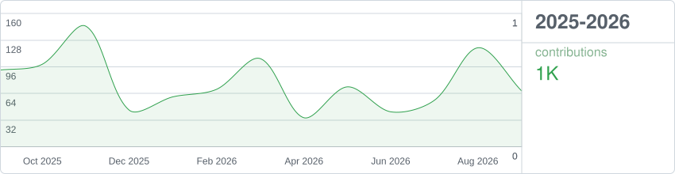
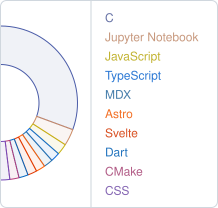

<h1 align="center">
  I'm Lakshyajeet Jalal
</h1>

  My girlfriend made this and asked me to put this up

## Here are some of my stats

<picture>
  <source media="(prefers-color-scheme: dark)" srcset="assets/stats-dark.svg">
  
</picture>

  <picture>
    <source media="(prefers-color-scheme: dark)" srcset="assets/languages-dark.svg">
    
  </picture>

  I like c
   
  c is simple
   
  c is elegant
   
  c is beautiful.
   
  Rust is also good.
   

