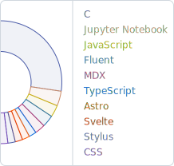
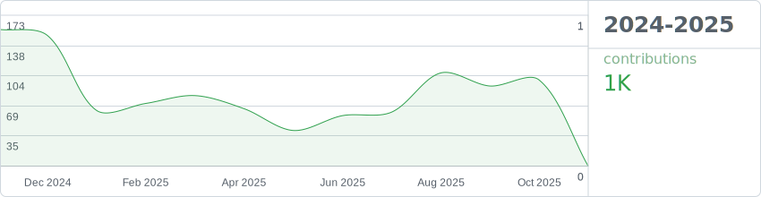

### I'm Lakshyajeet Jalal

  <picture>
    <source media="(prefers-color-scheme: dark)" srcset="assets/languages-dark.svg">
    
  </picture>

  I tell computers to do stuff.
   
  Sometimes they listen
   
   
  #[PCMR](https://pcmasterrace.org/) #[OpenSource](https://en.wikipedia.org/wiki/Open_source)

 
<picture>
  <source media="(prefers-color-scheme: dark)" srcset="assets/stats-dark.svg">
  
</picture>

<picture align="center">
  <source media="(prefers-color-scheme: dark)" srcset="https://raw.githubusercontent.com/mglsj/mglsj/snake/github-snake-dark.svg" />
  <source media="(prefers-color-scheme: light)" srcset="https://raw.githubusercontent.com/mglsj/mglsj/snake/github-snake.svg" />
  
</picture>
